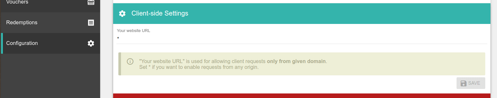
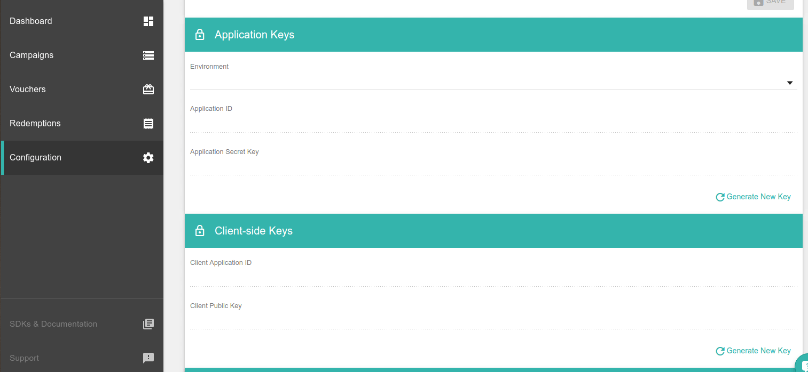
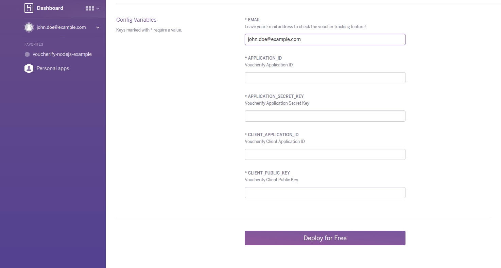
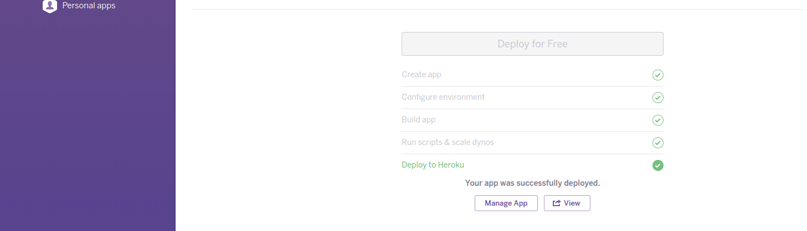

# Voucherify - Node.js SDK sample application

## Overview

This sample application aims to show the possibilities of **Voucherify Node.js SDK** and **Voucherify.js** libraries. You can try out this app by going to [Live Version](https://voucherify-sample-nodejs.herokuapp.com/) or by clicking the Deploy to Heroku button.

## Setup

It is really simple to setup this app. Only what you need to do is follow the steps listed below:

1. You need a set of *Application Keys* and *Client-side Keys* to connect with **Voucherify Platform**. Visit App.

2. After signing up you need also add your domain to Voucherify's whitelist.
When you go to configuration view of Voucherify account, "Your website URL" is used for allowing client requests only from given domain. You have to put there your website url or set * if you want to enable requests from any origin.

    

3. Press this button to create a Heroku app

    

    Wait until the Deploy Window is open.

4. After opening the Deploy Window, please go to the [**Configuration**](https://app.voucherify.io/#/app/configuration) page.

    Copy App Keys from the Configuration page and paste these keys into proper input fields in the Deploy Window.

    

5. In the Deploy Window after filling all required inputs click a Deploy Button located on the end of page. Wait until the Deploying Process is finish.

    

6. After finishing process you can go to the Manage Panel or visit the Voucherify Example page.

    

## Commands

* `$ npm run start` - runs the application

## Help

* Found a bug? Have a suggestion for improvement? Want to tell us we're awesome? [**Submit an issue**](https://github.com/voucherifyio/voucherify-nodejs-example/issues/new)
* Trouble with your integration? Contact [**Voucherify Support**](https://voucherify.readme.io/docs/support) / [**support@voucherify.io**](support@voucherify.io)
* Want to contribute? [**Submit a pull request**](https://github.com/voucherifyio/voucherify-nodejs-example/compare)

## Disclaimer

This code is provided as is and is only intended to be used for illustration purposes. This code is not production-ready and is not meant to be used in a production environment. This repository is to be used as a tool to help developers learn how to integrate with Voucherify. Any use of this repository or any of its code in a production environment is highly discouraged.